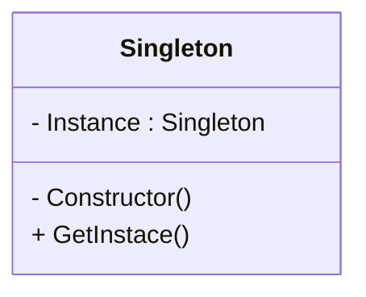

# Intenção

**Garantir que uma classe tenha somente uma instancia no programa e fornecer uma ponte de acesso global para a mesma**

- Usado para substituir variaveis globais
- Acessar recursos compartilhados (Objeto de configuracao,logger)
- Impedir que outro codigo sobrescreva seu valor original

# Estrutura



# Implementação

```ts
export class Singleton {
  private static _instance: Singleton | null = null;

  private constructor() {}

  static get instance(): Singleton {
    if (Singleton._instance == null) {
      Singleton._instance = new Singleton();
    }

    return Singleton._instance;
  }
}

const instance1 = Singleton.instance;
const instance2 = Singleton.instance;

console.log(instance1 == instance2); // true
```

# Aplicabilidade

- Quando uma classe precissa ter apenas uma instacia disponivel em todo o projeto
- Quando perceber que esta usando muitas variaveis globais para manter partes importantes do programa

| Pros                                          | Contras                                           |
| --------------------------------------------- | ------------------------------------------------- |
| Acesso controlado a instancia                 | É mais dificil testar                             |
| É facil permitir um numero maior de instacias | Viola o SRP                                       |
| É criado somento no momento do uso            | Requer tratamento especial em caso de concorencia |
| Substitu variaveis Globais                    | Não é mais tão recomendado usar                   |
